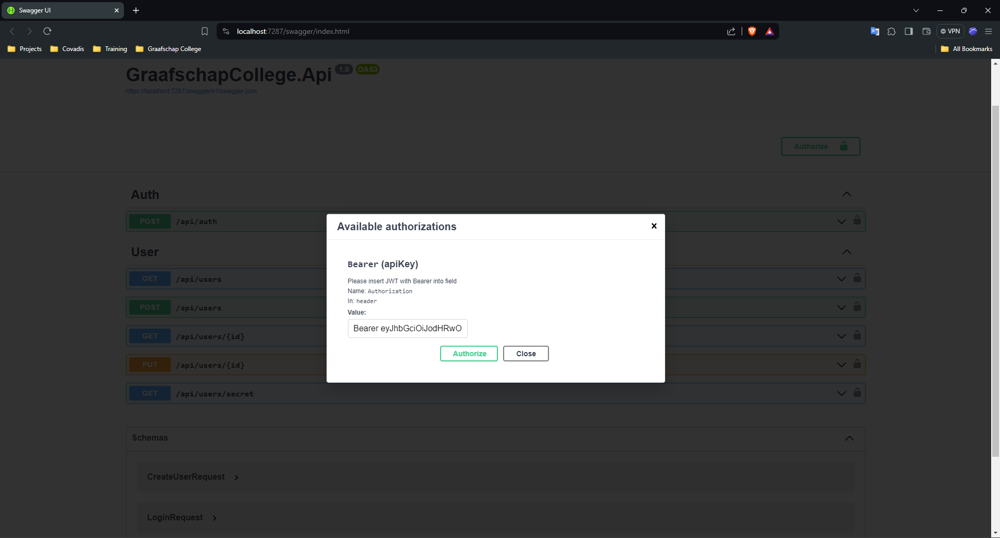

# Opdracht
Covadis heeft sinds kort een leenauto. Deze auto mogen werknemers gebruiken om bijvoorbeeld naar klantafspraken te gaan. Wat belangrijk is bij leenauto’s is het bijhouden van de kilometerstand per rit. Dat heeft te maken met allerlei regels op het gebied van belasting. We moeten hiervoor dus een registratie hebben met daarin beschreven welke collega in de auto reed. Wat daarvan de begin- en eindstand zijn en van welk adres, naar welk adres er is gereden. De werknemers gebruiken de applicatie vaak in de auto, dus het moet beschikbaar zijn via telefoon.

Op den duur zou het ook mooi zijn als we op basis van GPS of beeldherkenning bepaalde onderdelen van deze applicatie nog verder kunnen automatiseren. Denk bijvoorbeeld aan het automatisch registreren van de locatie van een gebruiker, of het uitlezen van de kilometerstand op basis van een foto.

Verder moet er ook een beheerportaal zijn voor het systeem. In dit portaal moeten alle registraties staan en deze registraties moeten kunnen worden geëxporteerd naar Excel. Dit gedeelte van het systeem mag alleen toegankelijk zijn voor een select groepje mensen.

# Methoden en technieken
We ontwikkelen drie applicaties
- ASP.NET Core Web API (de backend)
- Windows Form App (de backoffice)
- Blazor Web App (de frontend)

## Meer informatie
- **Backend**: De backend is een ASP.NET Core Web API. Deze API is verantwoordelijk voor het verwerken van de data en het opslaan van de data in de database.

- **Frontend**: De frontend is een Blazor Web App. Deze app is verantwoordelijk voor het tonen van de data en het aanroepen van de backend.

- **Backoffice**: De backoffice is een Windows Form App. Deze app is verantwoordelijk voor het beheren van de data en het exporteren van de data naar Excel.

# MoSCoW
Er zijn functionaliteiten uitgewerkt volgens MoSCoW die staan in het Word document. Als je meer wilt weten over MoSCoW zelf kun je die informatie hier vinden: [link](https://www.icm.nl/extra/wat-is-de-moscow-methode/).

MoSCoW staat voor:
- Must have
- Should have
- Could have
- Won't have

# De GIDS
## Entity Framework Core
[Entity Framework Core](https://docs.microsoft.com/en-us/ef/core/)

### Opzet
Er is gebruik gemaakt van Entity Framework Core. Entity Framework Core is een ORM (Object Relational Mapper) die het mogelijk maakt om met .NET objecten te werken in plaats van SQL queries. Hierdoor is het makkelijker om met de database te werken.

Maak een db context aan die er ongeveer zo uitziet:
```csharp
public class GraafschapCollegeDbContext : DbContext
{
    public GraafschapCollegeDbContext(DbContextOptions<GraafschapCollegeDbContext> options) : base(options)
    {
    }

    public DbSet<User> Users { get; set; }
}
```

Daarna moet je de db context registreren in de `Program.cs` let op en gebruik de SQLite provider voor Entity Framework Core. Dit ziet er ongeveer zo uit:
```csharp
builder.Services.AddDbContext<GraafschapCollegeDbContext>(options =>
{
    options.UseSqlite(builder.Configuration.GetConnectionString("DefaultConnection"));
});
```

Je ziet dat er gebruik wordt gemaakt van een connection string. Deze connection string moet je toevoegen aan de `appsettings.json`:
```json
{
  "ConnectionStrings": {
    "DefaultConnection": "Data Source=app.db"
  }
}
```

Op deze manier is de database verbonden met de applicatie. En kun je die vervolgens injecteren in de verschillende services en/of controllers.

```csharp
public class UserService
{
    private readonly GraafschapCollegeDbContext dbContext;

    public UserService(GraafschapCollegeDbContext dbContext)
    {
        this.dbContext = dbContext;
    }
}
```

### Migraties
[Package Manager Console](https://docs.microsoft.com/en-us/ef/core/managing-schemas/migrations/#apply-migrations)

Om de database te migreren en de database te updaten kun je gebruik maken van de Package Manager Console. De Package Manager Console is een tool die je kunt gebruiken om commando's uit te voeren in Visual Studio.

Om de database te migreren kun je gebruik maken van het volgende commando:
```bash
Add-Migration InitialCreate
```

Om de database te updaten kun je gebruik maken van het volgende commando:
```bash
Update-Database
```

Om de migratie ongedaan te maken kun je gebruik maken van het volgende commando:
```bash
Remove-Migration
```

### Relaties en navigatie eigenschappen
[Relationships](https://docs.microsoft.com/en-us/ef/core/modeling/relationships)

In Entity Framework Core kun je relaties leggen tussen verschillende entiteiten. Dit kun je doen door navigatie eigenschappen toe te voegen aan de entiteiten.

In dit voorbeeld gebruiken we een `User` en een `Role` entiteit. Een `User` kan een of meerdere `Roles` hebben. Entity Framework Core maakt automatisch een koppeltabel aan voor de relatie. Dit ziet er ongeveer zo uit:

```csharp
public class User
{
    public int Id { get; set; }
    public string Name { get; set; }
    public virtual ICollection<Role> Roles { get; set; }
}

public class Role
{
    public int Id { get; set; }
    public string Name { get; set; }
    public virtual ICollection<User> Users { get; set; }
}
```

Als je goed hebt gekeken zie je dat er een `virtual` keyword is toegevoegd aan de navigatie eigenschappen. Dit is nodig voor lazy loading. Lazy loading is een techniek die Entity Framework Core gebruikt om data op te halen wanneer het nodig is.

Voor andere relatie types kun je de documentatie raadplegen.

### Seed data
[Seed Data](https://docs.microsoft.com/en-us/ef/core/modeling/data-seeding)
[Custom Seeder](https://code-maze.com/migrations-and-seed-data-efcore/)

Ik heb ervoor gekozen om een custom seeder te maken. Dit is een klasse die de database vult met data. Dit is handig voor testen en ontwikkelen.

In de `Program.cs` voegen wij het volgende toe:
```csharp
using (var scope = app.Services.CreateScope())
{
    var scopedServices = scope.ServiceProvider;
    var dbContext = scopedServices.GetRequiredService<GraafschapCollegeDbContext>();
    dbContext.Database.Migrate();
    dbContext.Seed();
}
```

Hiermee wordt de database automatisch op opstarten gemigreerd en wordt de database gevuld met data.

De `Seed` ziet er als volgt uit:
```csharp
public static class Seeder
{
    public static void Seed(this GraafschapCollegeDbContext dbContext)
    {
        RoleSeeder.Seed(dbContext);
        UserSeeder.Seed(dbContext);
    }
}
```

De `RoleSeeder` ziet er als volgt uit:
```csharp
public static class RoleSeeder
{
    public static void Seed(GraafschapCollegeDbContext dbContext)
    {
        var existingRoles = dbContext.Roles
            .Select(x => x.Name)
            .ToList();

        var roles = new List<Role>
        {
            new() { Name = Role.Administrator },
            new() { Name = Role.Employee }
        };

        var rolesToAdd = roles
            .Where(x => !existingRoles.Contains(x.Name))
            .ToList();

        dbContext.Roles.AddRange(rolesToAdd);
        dbContext.SaveChanges();
    }
}
```

De `UserSeeder` ziet er als volgt uit:
```csharp
public static class UserSeeder
{
    public static void Seed(GraafschapCollegeDbContext dbContext)
    {
        var existingUsers = dbContext.Users
            .Select(x => x.Email)
            .ToList();

        var roles = dbContext.Roles.ToList();

        var users = new List<User>
        {
            new()
            {
                Name = "Bryan Schoot",
                Email = "b.schoot@example.com",
                Password =  BCrypt.Net.BCrypt.HashPassword("Password123!"),
                Roles = [roles.Find(x => x.Name == Role.Administrator)!]
            },
            new()
            {
                Name = "John Doe",
                Email = "j.doe@example.com",
                Password =  BCrypt.Net.BCrypt.HashPassword("Password123!"),
                Roles = [roles.Find(x => x.Name == Role.Employee)!]
            }
        };

        var usersToAdd = users
            .Where(x => !existingUsers.Contains(x.Email))
            .ToList();

        dbContext.Users.AddRange(usersToAdd);
        dbContext.SaveChanges();
    }
}
```

We moeten eerst de `Roles` toevoegen aan de database en daarna de `Users`. Dit komt omdat de `Users` een relatie hebben met de `Roles`. Als we eerst de `Users` toevoegen, dan krijgen we een foutmelding omdat de `Roles` nog niet bestaan.

## Dependency injection
[Dependency Injection](https://docs.microsoft.com/en-us/aspnet/core/fundamentals/dependency-injection)

Wij injecteren de services in de controllers en de services in de services. Dit zorgt ervoor dat de controllers en de services niet afhankelijk zijn van de implementatie van de services.

De verschillende scopes van dependency injection zijn:
- Transient: Een nieuwe instantie van de service wordt gemaakt voor elke aanroep.
- Scoped: Een instantie van de service wordt gemaakt voor elke HTTP request.
- Singleton: Een instantie van de service wordt gemaakt voor de gehele applicatie.

In de `Program.cs` voegen wij de services toe aan de services we gebruiken hier de `Transient` scope omdat we de kortste levensduur willen hebben voor de services. Dit zorgt ervoor dat de services niet te lang in het geheugen blijven staan. Dit ziet er zo uit:
```csharp
builder.Services.AddTransient<UserService>();
```

In de `UserService` injecteren wij de `GraafschapCollegeDbContext`:
```csharp
public class UserService
{
    private readonly GraafschapCollegeDbContext dbContext;

    public UserService(GraafschapCollegeDbContext dbContext)
    {
        this.dbContext = dbContext;
    }
}
```

Dit zorgt ervoor dat de `UserService` de `GraafschapCollegeDbContext` kan gebruiken om data op te halen en te bewerken.

De `GraafschapCollegeDbContext` is een `Scoped` service. Dit betekent dat de `GraafschapCollegeDbContext` een instantie is die voor elke HTTP request wordt gemaakt. Dit is handig omdat we op deze manier toevoegingen en wijzigingen kunnen doorvoeren in de database binnen dezelfde transactie.

## Authenticatie en autorisatie
Er is een authenticatie en autorisatie systeem geïmplementeerd in de backend. De backend maakt gebruik van JWT tokens.

### Toevoegen van authenticatie en autorisatie
[JWT](https://jwt.io/)
[Authentication Schemas](https://learn.microsoft.com/en-us/aspnet/core/security/authorization/limitingidentitybyscheme?view=aspnetcore-8.0)
Om authenticatie en autorisatie toe te voegen aan de backend kun je gebruik maken van de volgende stappen:

In de `Program.cs` voegen wij een nieuw schema toe `AddAuthentication` en `AddJwtBearer` aan de services:
```csharp
builder.Services.AddAuthentication(JwtBearerDefaults.AuthenticationScheme)
    .AddJwtBearer(options =>
    {
        options.TokenValidationParameters = new TokenValidationParameters
        {
            ValidateIssuer = true,
            ValidateAudience = true,
            ValidateLifetime = true,
            ValidateIssuerSigningKey = true,
            ValidIssuer = builder.Configuration["Jwt:Issuer"],
            ValidAudience = builder.Configuration["Jwt:Audience"],
            IssuerSigningKey = new SymmetricSecurityKey(Encoding.UTF8.GetBytes(builder.Configuration["Jwt:Key"]!)),
            ClockSkew = TimeSpan.Zero
        };
    });
```

Je ziet ook hier dat er gebruik wordt gemaakt van een `Jwt:Issuer`, `Jwt:Audience` en `Jwt:Key`. Deze waardes moeten worden toegevoegd aan de `appsettings.json`:
```json
{
  "Jwt": {
    "Key": "Covadis_JWT_SuperSecret_LeenAuto_Project_01",
    "Issuer": "Covadis Leenauto",
    "Audience": "Covadis"
  }
}
```

Daarnaast voegen wij een `AddAuthorizationBuilder` toe aan de services:
```csharp
services.AddAuthorizationBuilder()
    .SetFallbackPolicy(new AuthorizationPolicyBuilder()
    .AddAuthenticationSchemes(JwtBearerDefaults.AuthenticationScheme)
    .RequireAuthenticatedUser()
    .Build());
```

Dit zorgt ervoor dat de gebruiker altijd terug moet komen met een geldige JWT token. Als de gebruiker geen geldige JWT token heeft, dan wordt de gebruiker niet toegelaten tot de applicatie.

Daarna voegen wij de middlewares toe aan de `Program.cs`:
```csharp
app.UseAuthentication();
app.UseAuthorization();
```

Dit zorgt ervoor dat de authenticatie en autorisatie middelwares worden toegevoegd aan de pipeline.

Het genereren van een JWT token gebeurt in de `AuthController` daar is een functie `Login` die een JWT token genereert en terugstuurt naar de gebruiker. Deze functie maakt gebruik van een `[AllowAnonymous]` attribute. Dit zorgt ervoor dat de gebruiker niet geauthenticeerd hoeft te zijn om deze functie aan te roepen:
```csharp
[AllowAnonymous]
[ApiController]
[Route("api/auth")]
public class AuthController(AuthService authService) : ControllerBase
{
    [HttpPost]
    public IActionResult Login([FromBody] LoginRequest request)
    {
        var response = authService.Login(request);

        if (response == null)
        {
            return Unauthorized();
        }

        return Ok(response);
    }
}
```

Je ziet dat we hier gebruik maken van de `AuthService` om de gebruiker te authenticeren. De `AuthService` wordt doormiddel van dependency injection geïnjecteerd in de `AuthController`.
```csharp
public class AuthService(GraafschapCollegeDbContext dbContext, TokenService tokenService)
{
    public AuthResponse? Login(LoginRequest request)
    {
        var user = dbContext.Users
            .Include(x => x.Roles)
            .SingleOrDefault(x => x.Email == request.Email);

        if (user == null || !BCrypt.Net.BCrypt.Verify(request.Password, user.Password))
        {
            return null;
        }

        return new AuthResponse
        {
            Id = user.Id,
            Name = user.Name,
            Email = user.Email,
            Token = tokenService.CreateToken(user)
        };
    }
}
```

In de `AuthService` wordt de gebruiker opgehaald uit de database en wordt het wachtwoord gecontroleerd. Als het wachtwoord overeenkomt met het wachtwoord in de database, dan wordt er een JWT token gegenereerd en teruggestuurd naar de gebruiker.

[BCrypt.Net](https://github.com/BcryptNet/bcrypt.net)

Je ziet dat er gebruikt wordt gemaakt van `BCrypt.Net` om het wachtwoord te controleren. `BCrypt.Net` is een library die je kunt gebruiken om wachtwoorden te hashen en te verifieren.

Daarnaast maken we gebruik maken van de `TokenService` om de JWT token te genereren. De `TokenService` wordt doormiddel van dependency injection geïnjecteerd in de `AuthService`.

```csharp
public class TokenService(IConfiguration configuration)
{
    private readonly SymmetricSecurityKey key = new(Encoding.UTF8.GetBytes(configuration["Jwt:Key"]!));

    public string CreateToken(User user)
    {
        var claims = new List<Claim>
        {
            new("id", user.Id.ToString()),
            new("name", user.Name),
            new("email", user.Email),
        };

        claims.AddRange(user.Roles.Select(role => new Claim("role", role.Name)));

        var signingCredentials = new SigningCredentials(key, SecurityAlgorithms.HmacSha256Signature);

        var token = new JwtSecurityToken(
            claims: claims,
            expires: DateTime.UtcNow.AddDays(7),
            signingCredentials: signingCredentials,
            issuer: configuration["Jwt:Issuer"],
            audience: configuration["Jwt:Audience"]);

        return new JwtSecurityTokenHandler().WriteToken(token);
    }
}
```
Willen we dit nu testen in Swagger, dan moeten we de Swagger UI aanpassen. Dit doen we in de `Program.cs`:
```csharp
services.AddEndpointsApiExplorer();
services.AddSwaggerGen(options =>
{
    options.AddSecurityDefinition("Bearer", new OpenApiSecurityScheme()
    {
        In = ParameterLocation.Header,
        Description = "Please insert JWT with Bearer into field",
        Name = "Authorization",
        Type = SecuritySchemeType.ApiKey
    });

    options.AddSecurityRequirement(new OpenApiSecurityRequirement()
    {
        {
            new OpenApiSecurityScheme
            {
                Reference = new OpenApiReference
                {
                    Type = ReferenceType.SecurityScheme,
                    Id = "Bearer"
                }
            },
            Array.Empty<string>()
        }
    });
});
```

Dit zorgt ervoor dat er een `Bearer` token kan worden toegevoegd aan de Swagger UI. Als je nu de Swagger UI opent, dan zie je rechtsboven een knop `Authorize`. Als je hierop klikt, dan kun je een JWT token toevoegen. Als je nu een request doet naar een beveiligde endpoint, dan wordt de JWT token meegestuurd in de header.

Je doet dan het volgende:
1. Login met een gebruiker via de `AuthController`
2. Kopieer de JWT token
3. Klik op de `Authorize` knop in de Swagger UI
4. Plak de JWT token in het veld


